# 📐 CampusServices — Diagrammes de conception

> Ensemble complet des diagrammes UML & conception du projet **CampusServices** (ENSET Mohammedia).
> Tous les diagrammes sont au format **Mermaid** (rendu natif GitHub / VS Code / Notion).

## 📋 Sommaire

1. [Diagramme de cas d'utilisation](#1-diagramme-de-cas-dutilisation)
2. [Diagramme de classes — Domaine métier](#2-diagramme-de-classes--domaine-métier)
3. [Diagramme de classes — Architecture en couches](#3-diagramme-de-classes--architecture-en-couches)
4. [Diagramme de packages](#4-diagramme-de-packages)
5. [Diagramme de séquence — Authentification](#5-diagramme-de-séquence--authentification)
6. [Diagramme de séquence — Emprunt d'une ressource](#6-diagramme-de-séquence--emprunt-dune-ressource)
7. [Diagramme de séquence — Retour d'une ressource](#7-diagramme-de-séquence--retour-dune-ressource)
8. [Diagramme de séquence — Réservation d'une salle](#8-diagramme-de-séquence--réservation-dune-salle)
9. [Diagramme de séquence — Soumission d'une demande administrative](#9-diagramme-de-séquence--soumission-dune-demande-administrative)
10. [Diagramme de séquence — Traitement de la demande (admin)](#10-diagramme-de-séquence--traitement-de-la-demande-admin)
11. [Diagramme d'états — Réservation de salle](#11-diagramme-détats--réservation-de-salle)
12. [Diagramme d'états — Demande administrative](#12-diagramme-détats--demande-administrative)
13. [Diagramme d'états — Emprunt](#13-diagramme-détats--emprunt)
14. [Diagramme d'activité — Workflow d'une demande](#14-diagramme-dactivité--workflow-dune-demande)
15. [Diagramme entité-association (MCD)](#15-diagramme-entité-association-mcd)
16. [Diagramme de déploiement](#16-diagramme-de-déploiement)

---

## 1. Diagramme de cas d'utilisation

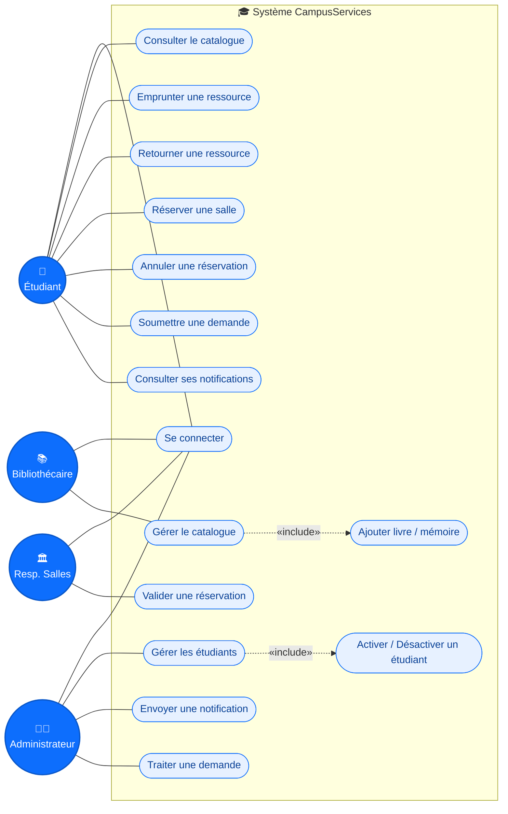

**Acteurs :**
- 👤 **Étudiant** — utilise les services courants (biblio, salles, demandes).
- 🧑‍💼 **Administrateur** — supervise et gère les étudiants & demandes.
- 📚 **Bibliothécaire** — gère le catalogue (livres, mémoires).
- 🏛 **Responsable salles** — valide ou refuse les réservations.

---

## 2. Diagramme de classes — Domaine métier

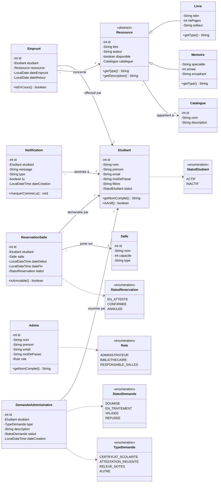

---

## 3. Diagramme de classes — Architecture en couches

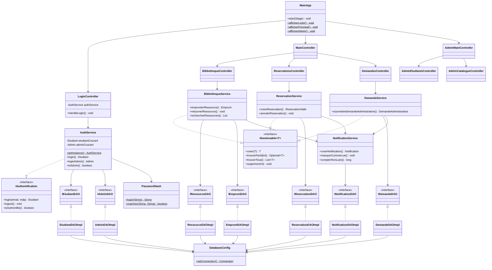

---

## 4. Diagramme de packages

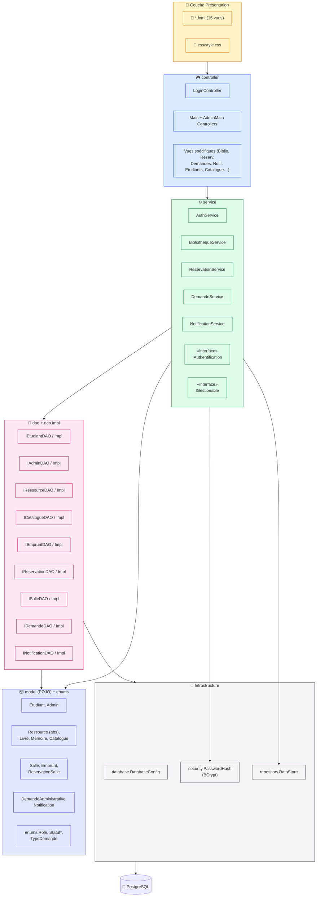

---

## 5. Diagramme de séquence — Authentification

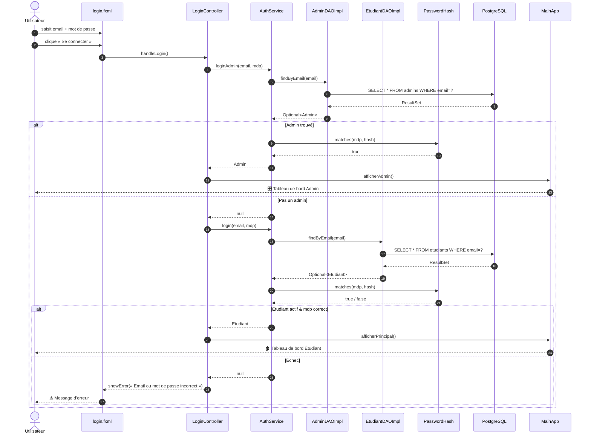

---

## 6. Diagramme de séquence — Emprunt d'une ressource

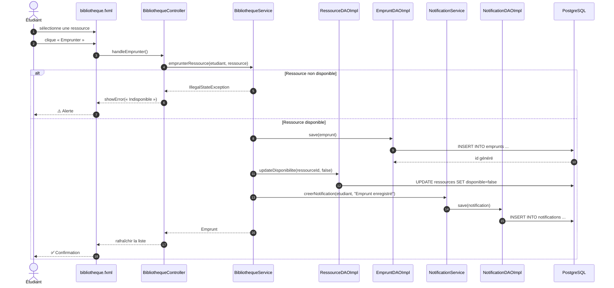

---

## 7. Diagramme de séquence — Retour d'une ressource

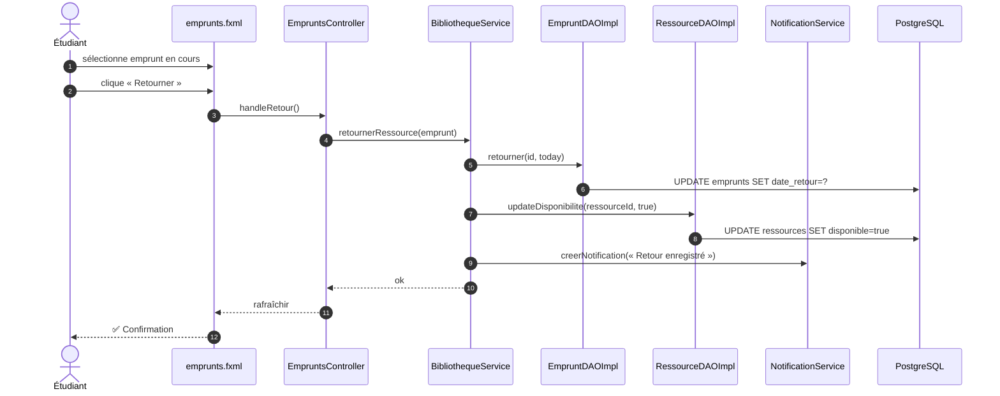

---

## 8. Diagramme de séquence — Réservation d'une salle

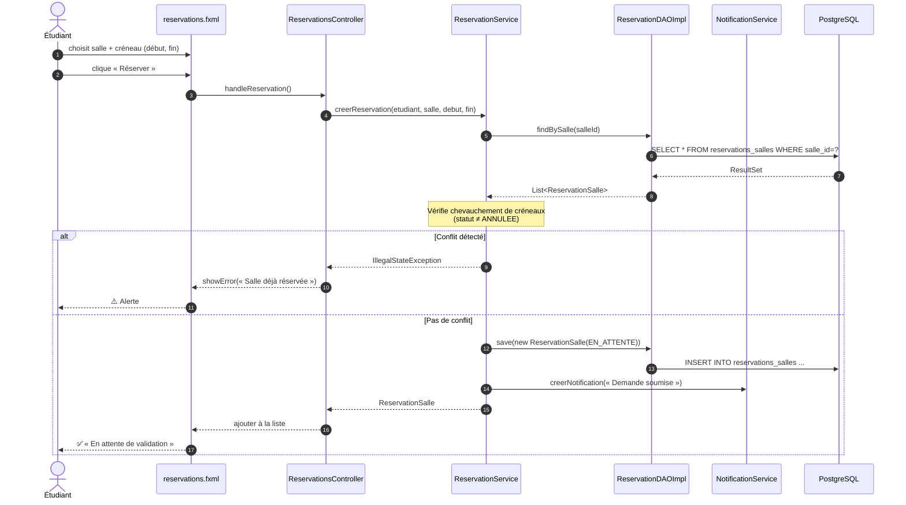

---

## 9. Diagramme de séquence — Soumission d'une demande administrative

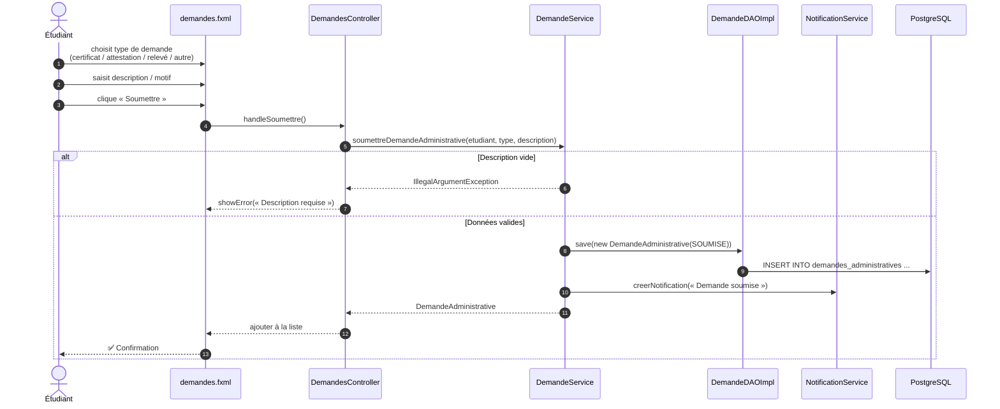

---

## 10. Diagramme de séquence — Traitement de la demande (admin)

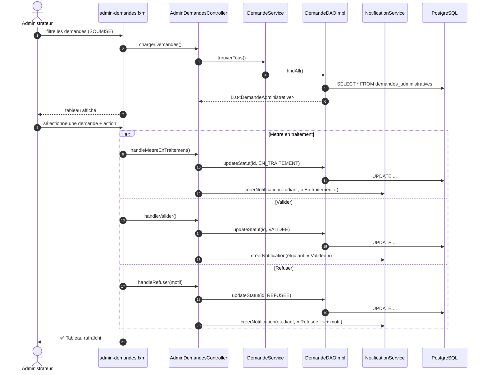

---

## 11. Diagramme d'états — Réservation de salle

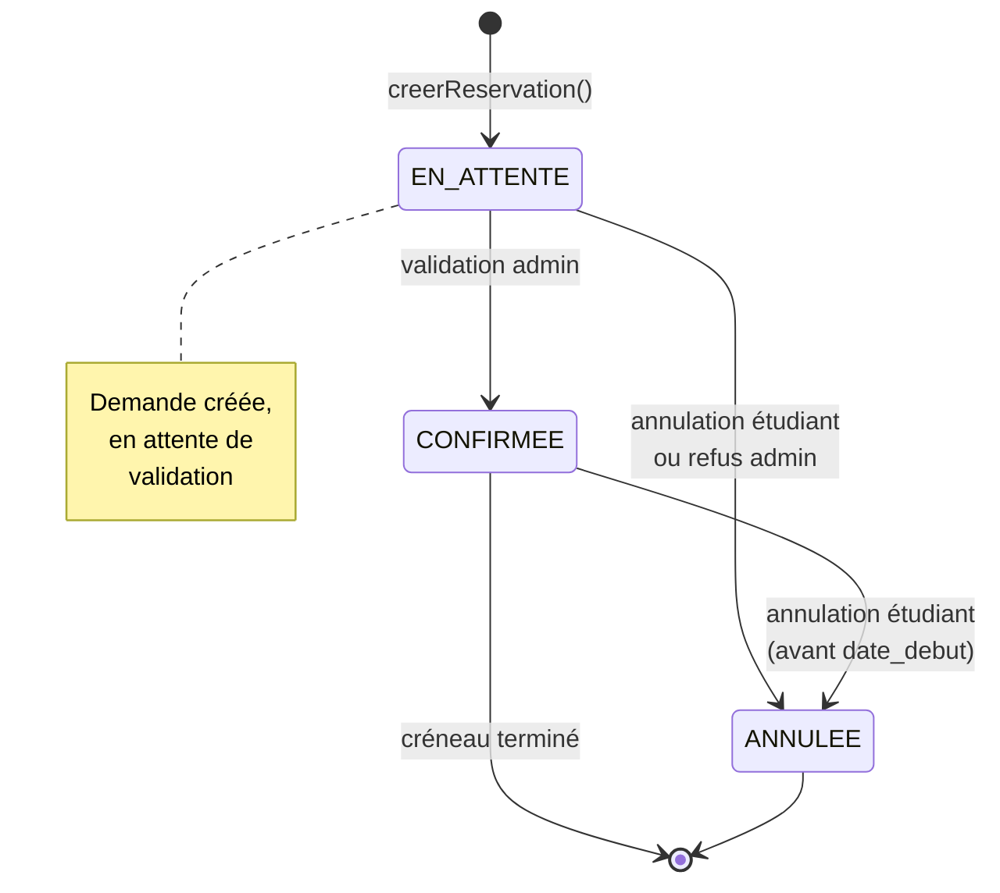

---

## 12. Diagramme d'états — Demande administrative

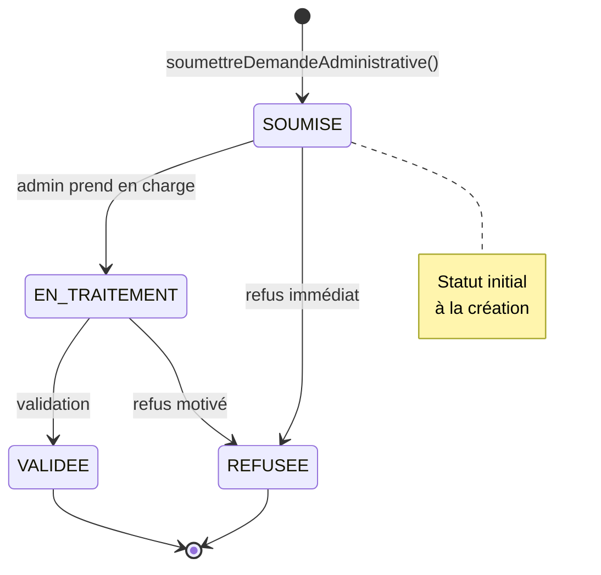

---

## 13. Diagramme d'états — Emprunt

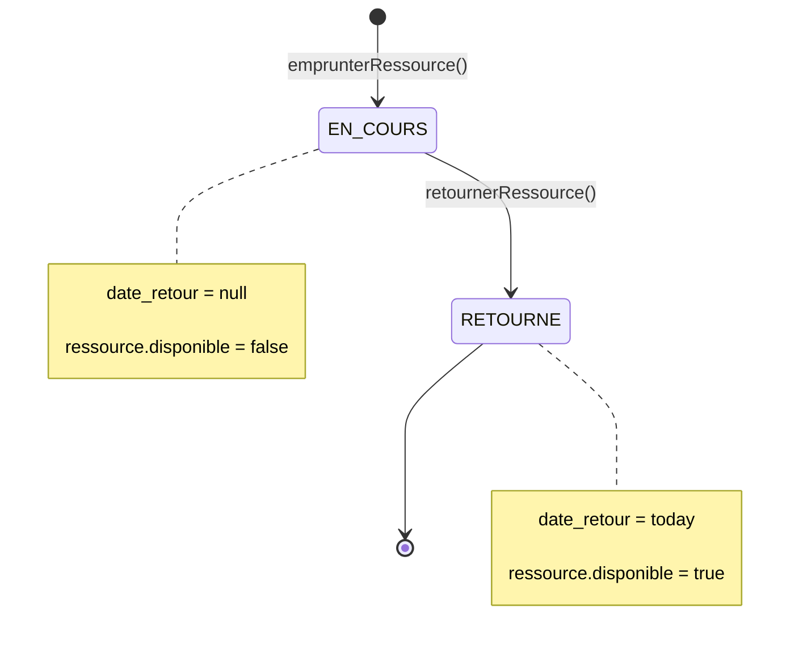

---

## 14. Diagramme d'activité — Workflow d'une demande

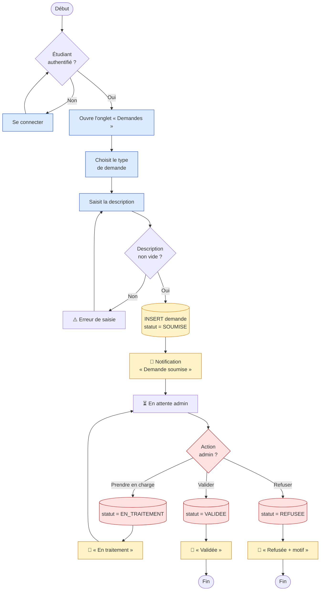

---

## 15. Diagramme entité-association (MCD)

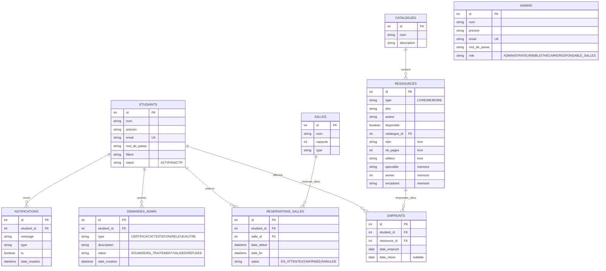

---

## 16. Diagramme de déploiement

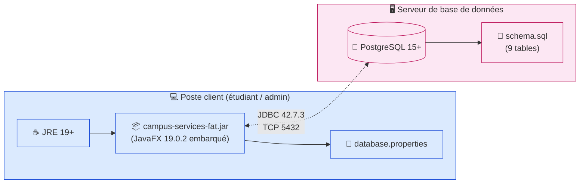

**Détails de déploiement :**
- **Poste client** : JDK 19+, l'application est livrée en *fat-jar* (`maven-shade-plugin`), donc JavaFX n'a pas besoin d'être installé sur le poste.
- **Serveur** : PostgreSQL 15+ accessible en TCP sur le port 5432 (configurable).
- **Communication** : driver JDBC PostgreSQL 42.7.3 par-dessus TCP, identifiants dans `database.properties`.
- **Sécurité** : mots de passe stockés en **BCrypt** (jBCrypt 0.4) — jamais en clair.

---

  📐 Tous les diagrammes sont au format <strong>Mermaid</strong> — éditables directement dans le fichier. 
  Rendu natif sur <strong>GitHub</strong>, <strong>GitLab</strong>, <strong>VS Code</strong> (extension Mermaid Preview) et <strong>Notion</strong>.

